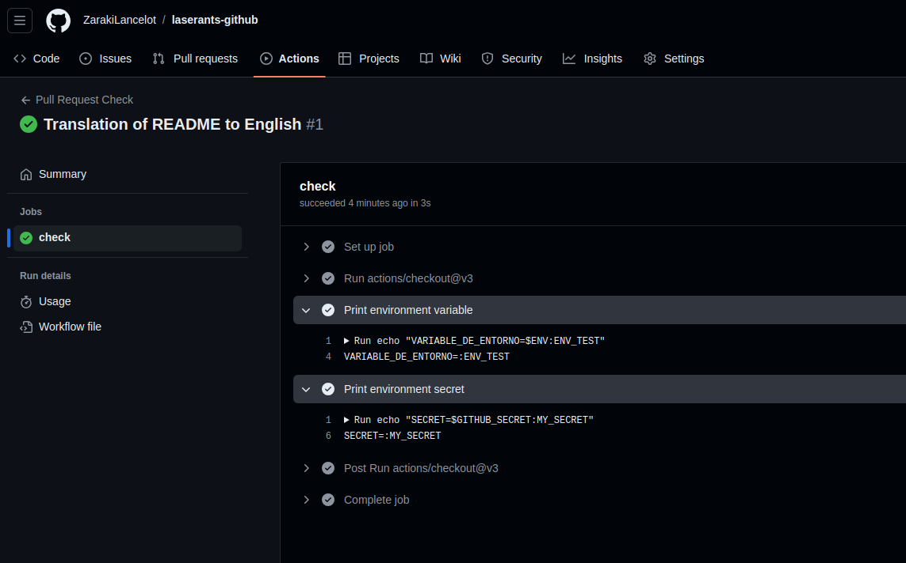

# Laserants Github

## Initial Configuraction and Use of Git and GitHub

## Introduction

Este documento te guiará a través de los pasos necesarios para configurar tu entorno de desarrollo utilizando Git y GitHub. Aprenderás a crear un repositorio público, conectar tu máquina local a través de SSH, realizar cambios y subirlos a GitHub, y opcionalmente, configurar una acción de GitHub para ejecutar tareas automatizadas al abrir una solicitud de extracción.

## Prerrequisitos

* **Cuenta de GitHub:** Crea una en [https://github.com/](https://github.com/) si aún no la tienes.

* **Git instalado:** Descarga e instala Git desde [https://git-scm.com/](https://git-scm.com/).

### Generando una Clave SSH

1. ```bash
   ssh-keygen -t rsa -b 4096 -C "tu_correo_electronico@ejemplo.com"
   ```

    * Reemplaza ```tu_correo_electronico@ejemplo.com``` con tu correo electrónico.

    * Sigue las instrucciones para guardar la clave y crear una frase de contraseña (opcional).

2. **Agregando la clave pública a GitHub:**

    * Copia el contenido del archivo ```~/.ssh/id_rsa.pub```.

    * Ve a [https://github.com/settings/keys](https://github.com/settings/keys) y agrega una nueva clave SSH, pegando el contenido copiado en el campo correspondiente.

### Creando un Repositorio en GitHub

1. Ve a [https://github.com/new](https://github.com/new).

2. Ingresa un nombre para tu repositorio (por ejemplo, ```mi-primer-proyecto```).

3. Selecciona "Público" y haz clic en "Crear repositorio".

### Clonando el Repositorio Localmente

1. ```bash
   git clone git@github.com:tu_usuario_de_github/mi-primer-proyecto.git
   ```

    * Reemplaza ```tu_usuario_de_github``` y ```mi-primer-proyecto``` con tus datos.

### Realizando Cambios y Subiendo al Repositorio

1. Crear un archivo: Dentro de la carpeta del proyecto, crea un nuevo archivo (por ejemplo, ```README.md```).

2. Agregar cambios: ```git add .```

3. Confirmar cambios: ```git commit -m "Mensaje descriptivo de tu commit"```

4. Subir cambios a GitHub: ```git push origin main```

### Creando una Acción de GitHub (Opcional)

1. Crear un archivo llamado ```.github/workflows/pull_request.yml``` en la raíz de tu repositorio.

2. ```yaml
   name: Pull Request Check
   
   on:
    pull_request:
      branches: [ main ]
      
   jobs:
    check:
      runs-on: ubuntu-latest
      steps:
        - uses: actions/checkout@v3
        - name: Print environment variable
          run: |
            echo "VARIABLE_DE_ENTORNO=$ENV:EJEMPLO"
        - name: Print environment secret
          run: |
            echo "SECRETO=$GITHUB_SECRET:MI_SECRETO"
          env:
            MI_SECRETO: ${{ secrets.MI_SECRETO }}
   ```

    * **Crear un secreto en GitHub:** Ve a los ajustes de tu repositorio, luego a "Secrets" y agrega un nuevo secreto llamado ```MI_SECRETO```.

### Explicación de la Acción de GitHub

* Se ejecuta cuando se abre una solicitud de extracción en la rama ```main```.

* Imprime una variable de entorno pública y una privada (creada en los secretos de GitHub).

  **¡Listo!** Ahora tienes una guía completa para comenzar a utilizar Git y GitHub para tus proyectos.
  

### Consejos adicionales

* **Personaliza:** Adapta este README a tus necesidades específicas y al proyecto en el que estés trabajando.

* **Explora:** Git y GitHub ofrecen muchas más funcionalidades. Te recomiendo que explores su documentación para aprender más.

* **Comunidad:** Únete a comunidades en línea para resolver dudas y aprender de otros desarrolladores.

### Recursos útiles

* **Documentación de Git:** [https://git-scm.com/doc](https://git-scm.com/doc)

* **Documentación de GitHub:** [https://docs.github.com/](https://docs.github.com/)
